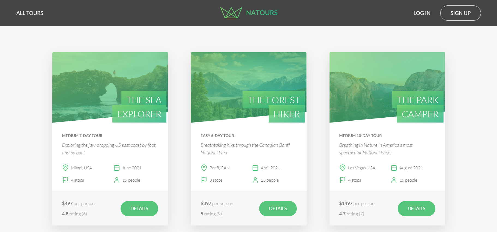

# Natours

A project for a travel agency which is based on tour bookings. This app is built using Node.js - Express.js - MongoDB - Mongoose.

  

# General Info

Natours is web application which is built using a RESTful API along with JWT authentication, Node.js security, payments with Stripe & more. The application follows the MVC Architecture. 

# Technologies Used
* NodeJS
* ExpressJS
* MongoDB
* Mongoose
* Stripe

This site can be found [here](https://frozen-reaches-64154.herokuapp.com/)

# Status
Currently under progress to add more features as
* Make website responsive
* Add sign up page
* Add links to User Accounts Settings

**Note**: To login enter the following credentials
* **Email Address** : leo@example.com 
* **Password** : test1234

To book tour enter following card detail
* **Card Number** : 4242 4242 4242 4242
